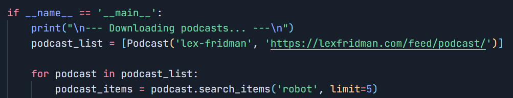

# Podcast Downloader & Transcriber
Search your favourite podcasrs and downlaod them with single line


## Setup
Fork the repo

Download all the required librabries by running
```pip install -r path/to/requirements.txt```

You need to specify which Podcasts to run. Go into the [download_podcasts.py] & [transcriptions.py] and edit the ```podcast_list``` located at the bottom of each file. 

Insert Podcast objects for each podcast that you want to programmatically scrape with Python. 
1. The first argument is the name of the podcast, 
2. The second argument is the URL for the podcast's RSS feed. You can get the rss feed by going to 
[Get RSS Feed](https://getrssfeed.com)
3. Next you should set how many podcast episodes you want to download from each podcast by modifying the ```limit``` variable. You can also modify the search term to filter which types of episodes you download. In this example it is 'robot'. If you don't want a search term, uncomment the line that says get_items and comment the line that says search_items. 


Once you are done with these components, you can run the bash script ```run_all.sh``` to download & transcribe your podcasts. Listen the peacefully! 
